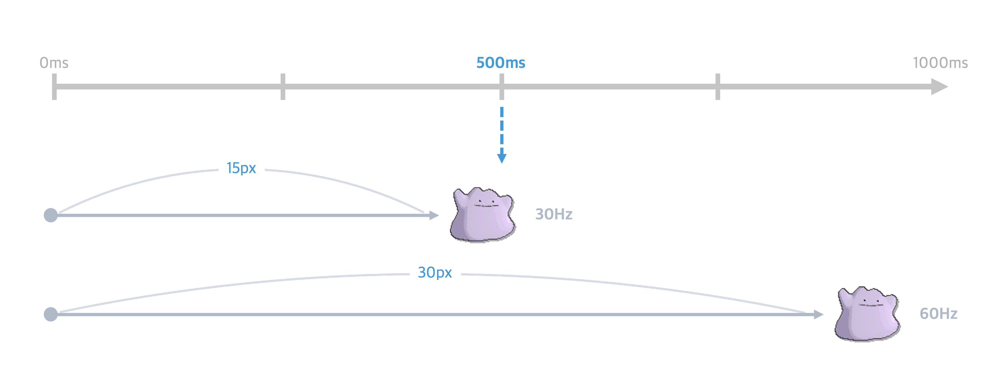
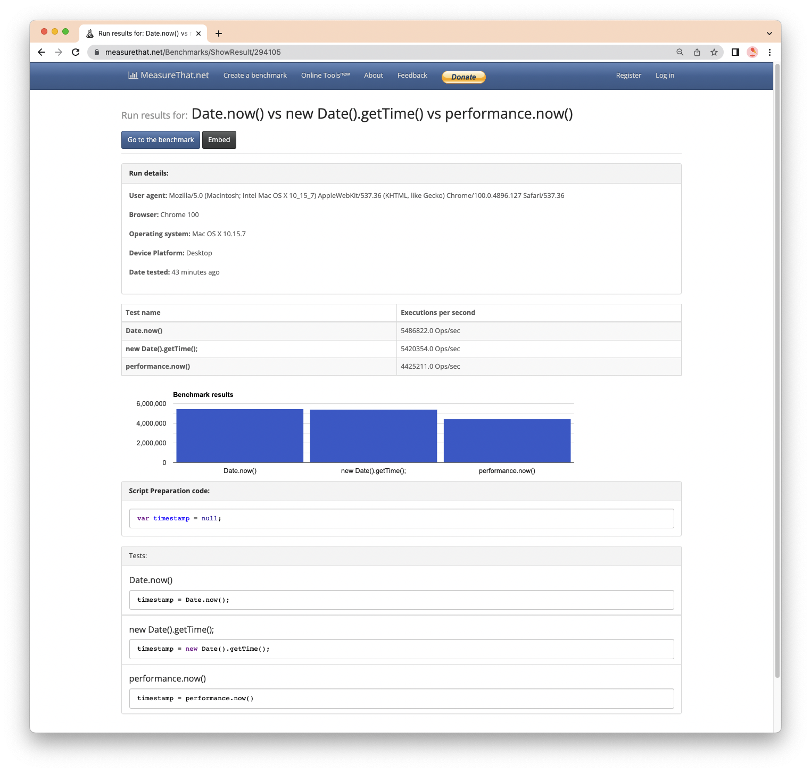

애니메이션 함수로 **requestAnimationFrame**을 사용하는 이유는 해당 포스팅을 참고해주세요. 😘

<div class="embedded-linkin">
<a href="https://jieunhanme.github.io/javascript-animation-loop/" target="_blank" >
<div class="linkin-info">추천 포스팅</div>
<div class="linkin-title">어떤 Animation Loop를 사용하는게 좋을까?</div>
</a>
</div>

<br />

## 😾 화면 주사율에 따른 애니메이션 진행도 이슈란?

애니메이션 효과를 부여할때 **진행값을 기기 성능차를 고려하지 않는 값**으로 정한다면 어떻게 될까요?
이는 디스플레이의 `화면 주사율`에따라 **애니메이션의 진행도가 다르게 표현되는 이슈가 발생** 할 수 있어요.



<p class="img-caption" style="margin: -20px 10px 0 10px ">
1프레임당 1px씩 오른쪽으로 이동하는 애니메이션 생성 시, 화면 주사율에 따라 발생하는 이슈
</p>
<br />

메타몽을 **1프레임당 우측으로 1px씩 나아가도록** 설정했을 때, `30Hz`의 디스플레이에서는 0.5초(500ms)가 되었을 때 **15px 이동**한 것을 확인할 수 있어요.
반면에 `60Hz`의 디스플레이에서는 0.5초가 되었을 때 **30px 이동**했죠. 이동 거리의 차이는 시간이 흐를수록 더 벌어질거에요.

이는 유저가 동일한 화면 진행도를 유지해야하는 게임과 같은 화면에는 `치명적인 이슈`가 될 수 있는데요. 😱
그렇다면, 디스플레이의 화면 주사율이 다른 경우 **애니메이션의 진행도를 어떻게 동일하게 맞춰줄 수 있을까요?**

지금부터, 다양한 화면 주사율에서 동일한 진행도를 유지할 수 있도록 **애니메이션의 성능을 보정**해봅시다.

---

## 😸 애니메이션의 성능을 보정해보자

해결방법은 간단합니다. 화면 주사율에 영향을 받지 않는 절대값인 `시간값`으로 애니메이션 진행도를 결정하면 됩니다.
디스플레이별 프레임수는 다르더라도 **`절대값`인 시간을 기준으로 실행하기 때문에 진행도는 동일하게 유지**됩니다.
시간값으로 애니메이션을 진행하는 **3가지 방법**을 알아봅시다.

<br />

### ⏰ Threejs의 내장 객체로 만들어보자

`OBJ` **Clock**
<br />

> 시간 추적을 위한 객체입니다. 내부 연산에서 `performance.now`를 사용하려하고, 후순위로 `Date.now`를 사용합니다.

#### 애니메이션이 진행된 후 총 경과 시간을 기준으로

`METHOD` **getElapsedTime()**
<br />

> Clock객체가 생성된 이후의 총 경과 시간 값을 리턴합니다. 총 경과 시간이기 때문에 값은 계속 커집니다.

애니메이션의 출력 횟수(프레임)는 달라도 **총 경과된 시간은 동일**하기에, 경과 시간을 기준으로 애니메이션의 진행율의 `일관성`을 유지할 수 있어요.
단점으로 총 경과 시간값을 리턴하기 때문에 **애니메이션의 조건 설정이 어려워지는 문제가 발생해요.**

<div class="codebox-title">main.js</div>

```javascript
const clock = new THREE.Clock();

function draw() {
  const time = clock.getElapsedTime();
  // 총 경과값 이므로 +=가 아닌 = 로 연산 진행합니다.
  // time에 숫자를 곱해 속도 조절을 할 수 있습니다.
  mesh.rotation.y = 1 * time;
  mesh.position.y = time;
  if (mesh.position.y > 3) {
    mesh.position.y = 0;
  }
  renderer.render(scene, camera);
  window.requestAnimationFrame(draw);
}
draw();
```

<video src="animation-of-threejs-02.mov" loop muted Autoplay=autoplay style="width: 100%; height: 100%; object-fit: cover;"></video>

<p class="img-caption" style="margin: -15px 10px 0 10px;">
time값은 계속 증가하기 때문에, 3초가 지난 뒤에는 항상 조건식을 만족하게 되는데요. 
<br />
시간값을 기준으로 위치값을 정하고 있기 때문에, 3초 뒤부터 mesh의 y값은 3보다 크기때문에 조건식에 걸려서  <b>항상 0으로 고정되는 문제가 발생해요.</b>
</p>

#### 애니메이션이 진행될 때 마다의 시간 간격을 기준으로

`METHOD` **getDelta()**

> 함수가 실행 될때마다의 시간 간격 값을 리턴하다. 실행될 때마다의 시간 간격값을 리턴하기 떄문에, `requestAnimationFrame` 함수 내부에서 사용할 경우 일정한 값을 리턴합니다.

**getDelta**는 함수 실행시 발생하는 시간 간격을 리턴하기 떄문에, **getElapsedTime**에서의 조건 설정이 어려운 점을 보완해줍니다.
주의 사항으로는 getDelta와 getElapsedTime을 같이 쓰면 안되는 점이 있습니다. Threejs의 내부적인 이슈로 같이 사용하면 값이 꼬이는 경향이 있으므로 사용에 주의해야해요.

<div class="codebox-title">main.js</div>

```javascript
const clock = new THREE.Clock();

function draw() {
  const delta = clock.getDelta();
  // 누적값이 아니므로 += 연산으로 진행합니다.
  mesh.rotation.y += 1 * delta;
  mesh.position.y += delta;
  if (mesh.position.y > 3) {
    mesh.position.y = 0;
  }
  renderer.render(scene, camera);
  window.requestAnimationFrame(draw);
}
draw();
```

<video src="animation-of-threejs-03.mov" loop muted Autoplay=autoplay style="width: 100%; height: 100%; object-fit: cover;"></video>

<p class="img-caption" style="margin: -15px 10px 0 10px;">
애니메이션의 조건 설정은 getDelta함수가 더 용이합니다.
</p>
<br />

### 📅 Javascript의 내장 객체로 만들어보자

Javascript의 내장 객체로 Threejs의 Clock.getDelta()와 동일한 역할을 하는 로직을 만들 수 있어요.
해당 방법은 Threejs뿐만 아니라, **Canvas를 비롯해 javascript를 사용한다면 응용할 수 있다는 장점**이 있습니다.

`METHOD` **Date.now()**

> UTC기준으로 1970년 1월 1일 00:00:00 이후로 경과된 밀리세컨드값을 리턴합니다.

<div class="codebox-title">main.js</div>

```javascript
let oldTime = Date.now();

function draw() {
  // newTime : draw() 시작하는 시간
  const newTime = Date.now();
  // deltaTime : oldTime선언 후 draw() 시작하기까지의 간격 시간값
  const deltaTime = newTime - oldTime;
  // 반복 실행을 위해 draw가 실행했던 시간값을 oldTime으로 갱신
  oldTime = newTime;
  // 값이 크기때문에 소숫값을 곱해서 속도 조절을 해줘야합니다.
  mesh.rotation.y += 0.001 * deltaTime;
  mesh.position.y += 0.001 * deltaTime;
  if (mesh.position.y > 3) {
    mesh.position.y = 0;
  }
  renderer.render(scene, camera);
  window.requestAnimationFrame(draw);
}
draw();
```

<video src="animation-of-threejs-03.mov" loop muted Autoplay=autoplay style="width: 100%; height: 100%; object-fit: cover;"></video>

<p class="img-caption" style="margin: -15px 10px 0 10px;">
getDelta함수와 동일한 동작을 수행합니다.
</p>
<br />

## 😻 애니메이션 성능 보정의 결과

<video src="animation-of-threejs-05.mov" loop muted Autoplay=autoplay style="width: 100%; height: 100%; object-fit: cover;"></video>

<p class="img-caption" style="margin: -15px 10px 0 10px;">
왼쪽은 10Hz, 오른쪽은 120Hz의 설정으로 동작하는 동일한 애니메이션입니다.
</p>
<br />

## 👀 Date와 performance는 무슨 차이가 있을까?

오늘의 설명에서 등장하지 않았지만, `performance.now()`를 `Date.now()`대신에 사용하는 예제를 종종 접했어요.  
둘은 같은 역할을 하는 함수인데, 둘중 어느 함수가 더 나은 함수인지 굉장히 궁금했었는데 재밌는 비교 자료를 발견했습니다.

<a href="https://www.measurethat.net/Benchmarks/ShowResult/294105" target="_blank" >

</a>

<p class="img-caption" style="margin: -15px 10px 0 10px ">
이미지 클릭 시, 새창에서 자세히 볼 수 있습니다.
</p>
<br />

**`Date.now()`의 사용을 추천합니다.** 😉

---

오늘 알아본 3가지 방법을 사용한다면, **프레임 차이에 의한 애니메이션의 부드러움은 차이가 발생**할 수는 있지만 결과적으로는 **동일한 진행도를 유지**할 수 있습니다.

틀린 설명 혹은 보충이 필요한 설명은 코멘트 달아주시면 감사하겠습니다! 🙏

```toc

```
