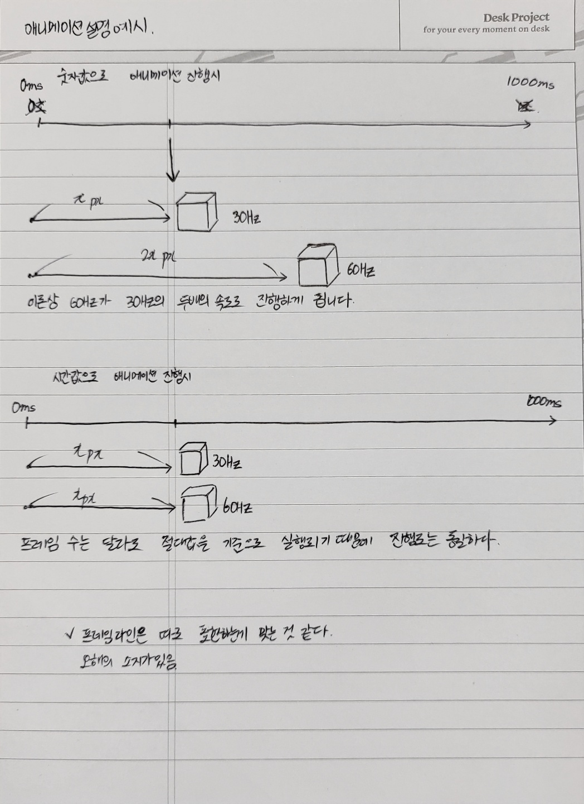

애니메이션 함수로 **requestAnimationFrame**을 사용하는 이유는 해당 포스팅을 참고해주세요

<div class="embedded-linkin">
<a href="https://jieunhanme.github.io/javascript-animation-loop/" target="_blank" >
<div class="linkin-info">추천 포스팅</div>
<div class="linkin-title">어떤 Animation Loop를 사용하는게 좋을까?</div>
</a>
</div>

## 화면 주사율에 따른 애니메이션 진행도 이슈

애니메이션 효과를 부여할때 **진행값을 기기 성능차를 고려하지 않는 값**으로 정한다면 어떻게 될까요?
이는 디스플레이의 `화면 주사율`에따라 **애니메이션의 진행도가 다르게 표현되는 이슈가 발생** 할 수 있어요.

> 예시 추가



<p class="img-caption">
1frame당 1px씩 오른쪽으로 이동하는 애니메이션 생성시, 기기의 성능에 따라 발생하는 이슈
</p>

위의 예시에서

1초 진행 60Hz 60px 이동

1초 진행 144Hz 144px 이동

이는 유저가 동일한 화면 진행도를 유지해야하는 게임과 같은 화면에는 치명적인 이슈가 될 수 있는데요.
그렇다면, 디스플레이의 화면 주사율이 다른 경우 **애니메이션의 진행도를 어떻게 동일하게 맞춰줄 수 있을까요?**

---

## 애니메이션 성능을 보정해보자

해결방법은 간단합니다. 화면 주사율에 영향을 받지 않는 절대값인 `시간값`으로 애니메이션 진행도를 결정하면 됩니다.
시간값으로 애니메이션을 진행하는 3가지 방법을 알아봅시다.

### 1. Threejs의 내장 객체 `Clock`

> **Clock** <br />시간 추적을 위한 객체입니다. 가능하면 `performance.now`를 사용하려하고, 후순위로 `Date.now`를 사용합니다.

#### THREE.Clock().getElapsedTime()

> 함수가 실행된 이후의 총 경과 시간 값을 리턴한다. 값은 계속 커진다

애니메이션의 출력 횟수는 달라도 경과된 시간은 동일하기에,

경과 시간을 기준으로 애니메이션 진행율을 일관성있게 유지할 수 있다.

setTimeout으로 30Hz, 60Hz환경 설정하고 비교 진행하면 좋을듯

총 경과값 이므로 +=가 아닌 = 로 연산 진행

속도 조절은 \*로 진행

대신!!! 진행률에 따른 조건설정이 어려워진다.

#### THREE.Clock().getDelta()

조건 설정이 어려운 점을 보완~

> 함수가 실행 될때마다의 시간 간격 값을 리턴하다.
>
> 증가하는 값이 아니라 일정한 값을 리턴한다

주의 사항!! getElapsedTime과 getDelta는 같이 쓰이면 값이 꼬일수 있으니 지양해야한다!

누적값이 아니므로 += 연산으로 진행

속도 조절은 \*로 진행

new THREE.Clock ().getDelta()와 같지만 threejs가 아닌 javascript 내장 객체 사용

### 2. Javascript의 내장 객체 `Date`

#### Date.now() 객체

> UTC기준으로 1970년 1월 1일 00:00:00 이후로 경과된 밀리세컨드값을 리턴한다

threejs뿐 아니라 일반 Canvas 머플리케이션에도 적용할 수 있는 계산식인게 장점이다

값이 크기때문에 소숫값을 곱해서 속도 조절해줘야...

[performance.new() vs Date.now()]

https://www.measurethat.net/Benchmarks/Show/7851/0/datenow-vs-new-dategettime-vs-performancenow

```toc

```
