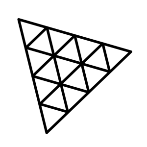
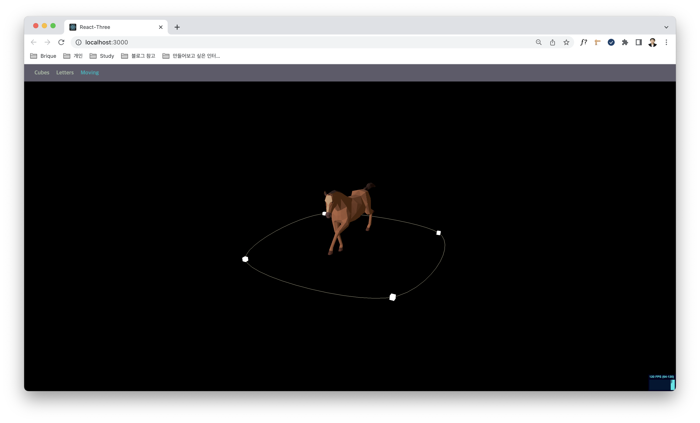
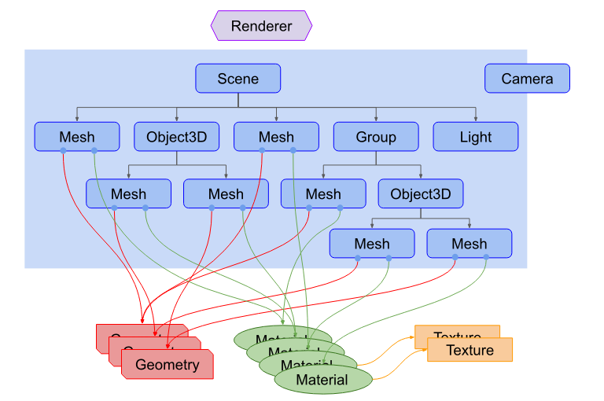
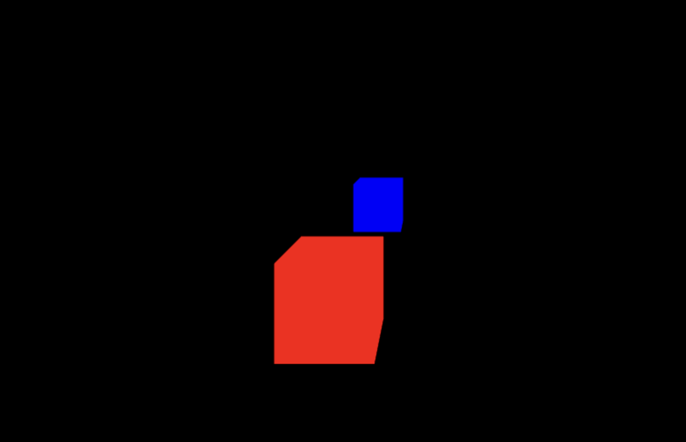
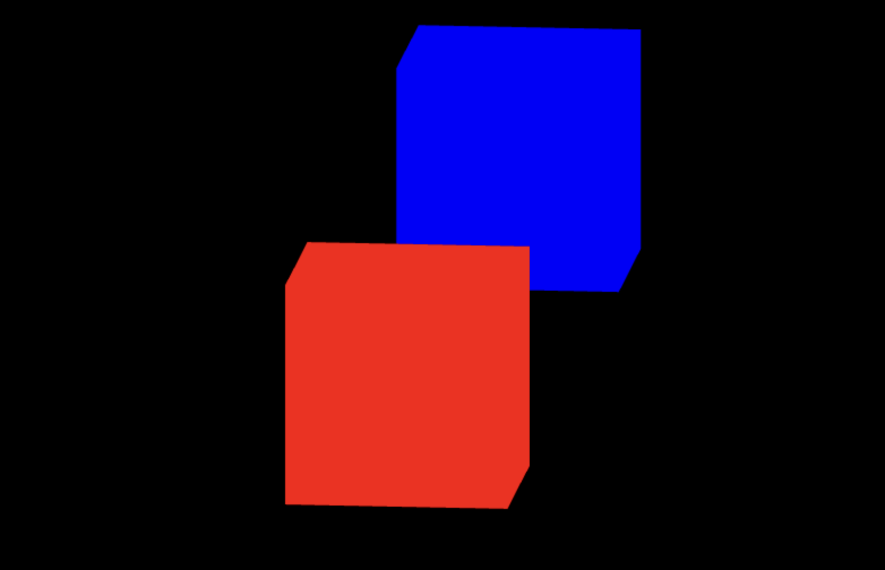

<a href="https://threejs.org/" target="_blank" >

</a>

---

최근 스크롤 인터렉션 웹 사이트 공부를 하면서, 더 화려하고 멋진 3D 웹사이트 구현에 자연스레 관심이 생겼다.
사실 나는 이전에 Threejs를 살짝 공부했다가 좌절한 경험이 있는데... 너무 매력적인 프레임워크지만, 쉽게 접할 수 있는 설명은 대부분 영어로 되어있어 Canvas도 미숙한 내게는 너무 어려웠었다.



<p style="color: #9E9E9E; font-size: 14px; text-align:center; margin: -30px 10px 0 10px;">그 당시 만들었던 3D 오브젝트... 선로를 따라 달리는 말을 표현하고 싶었지만 개념 이해를 제대로 하지 못해 결국 포기했다.개념을 제대로 익히지 않은 상태로 REACT로 개발한것도 한몫 했다.</p>
<br />

하지만 3D웹 사이트를 구현하고픈 나의 욕심이 나를 다시 Threejs앞으로 이끌었다. 이번에는 꼭 좋은 성과를 이루길 바라며 다시 기초부터 공부를 시작해보자!!

개발 환경은 webpack + module threejs를 바탕으로 진행했습니다.

---

## 👋 Three.js란?

**Three.js**는 웹페이지에 3D객체를 쉽게 렌더링하도록 도와주는 자바스크립트 3D 라이브러리이다.
Three.js는 3D객체를 렌더링하는데 `WebGL`을 사용합니다.

> **WebGL(web Graphics Library)** <br /> 점, 섬, 삼각형만 그리는 아주 단순한 자바스크립트

WebGL로 작업하려면 작업량이 많아지고 코드 자체도 복잡해질 수 밖에 없는데...
이런 단점을 보완하고자 3D 객체를 조금 더 편하고 효율적으로 짤 수 있게 도움을 주는 `Three.js`, `Babylon.js`와 같은 라이브러리를 사용한다고 합니다.

## 🗂 Threejs의 구성요소



<p style="color: #9E9E9E; font-size: 14px; text-align:center; margin: -15spx 10px 0 10px;">
three.js에서 제공하는 다이어그램
</p>
<br />

threejs로 표현을 하려면 Renderer, Scene 그리고 Camera가 반드시 있어야합니다.
<br />
각각의 요소가 어떤 역할을 하는지 하나씩 알아봅시다 🧐

<br />

### 🎬 Renderer

Renderer는 Three.js의 핵심 객체로 `Scene`과 `Camera`객체를 넘겨 받아 카메라의 절두체 안 3D씬의 일부를 평면(2차원) 이미지로 렌더링합니다. 쉽게, Camera가 담고있는 Scene를 화면에 출력해주는 객체라고 생각하시면 됩니다.
<br />
Renderer를 생성하는 방법을 아래와 같이 두가지가 있습니다.

1. javascript에서 renderer를 생성해 body에 붙이는 방법

<div class="codebox-title">main.js</div>

```javascript
const renderer = new THREE.WebGLRenderer();
renderer.setSize(window.innerWidth, window.innerHeight);
document.body.appendChild(renderer.domElement);
            ⋮
renderer.render(scene, camera);
```

<br />

2. body에 만들어둔 canvas태그를 사용해 renderer에 지정해주는 방법
<div class="codebox-title">index.html</div>

```html
<body>
  <canvas id="three-canvas"></canvas>
</body>
```

<div class="codebox-title">main.js</div>

```javascript
const canvas = document.querySelector('#three-canvas');
const renderer = new THREE.WebGLRenderer({ canvas });
renderer.setSize(window.innerWidth, window.innerHeight);
            ⋮
renderer.render(scene, camera);
```

<br />

### 🏙 Scene

Scene객체는 화면을 구성하는 `물체(Object)`와 `광원(Light)`를 저정하고 관리하는 역할을 합니다. 물체와 광원을 생성한 뒤, 해당 객체를 Scene객체에 포함시켜야 화면에 나타납니다.
해당 객체는 추후에 더 자세히 설명해보겠습니다.

<div class="codebox-title">main.js</div>

```javascript
const scene = new THREE.Scene();
scene.fog = new THREE.Fog('blue', 1.5, 7);

const light = new THREE.DirectionalLight(0xffffff, 1);
light.position.x = 1;
light.position.y = 3;
light.position.z = 5;
scene.add(light);
```


<p style="color: #9E9E9E; font-size: 14px; text-align:center; margin: -5px 10px 0 10px;">
    광원이 있어야 보이는 3D Object을 사용했습니다. 안개색은 배경와 같은 색을 사용하면 <b>Shadow</b>효과를 낼 수 있습니다.
</p>
<br />

### 📷 Camera

카메라는 Scene객체를 촬영하여 어떻게 보여줄 것인가를 결정합니다. 같은 Scene이라도 카메라의 위치 및 기타 설정값들을 통해서 다른 화면을 보여줄 수 있습니다.


<p style="color: #9E9E9E; font-size: 14px; text-align:center; margin: -15px 10px 0 10px;">
    시야각, 종횡비, <span style="color: rgb(110, 250,34)">near</span>, <span style="color: rgb(228, 64, 36)">far</span>에 따라 보이는 Scene이 변합니다.
</p>
<br />

Camera는 `PerspectiveCamera`와 `OrthographicCamera`가 있는데 객체별 코드와 결과를 확인해봅시다.

<div class="codebox-title">main.js - Perspective Camera</div>

```javascript
const camera = new THREE.PerspectiveCamera(
  75, // fov(시야각)
  window.innerWidth / window.innerHeight, // aspect(종횡비)
  0.1, // near
  1000, // far
);
// camera 위치 설정
camera.position.x = 1;
camera.position.y = 2;
camera.position.z = 5;
scene.add(camera);
```

<div class="codebox-title">main.js - Orthographic Camera</div>

```javascript
const camera = new THREE.OrthographicCamera(
  -(window.innerWidth / window.innerHeight), // left
  window.innerWidth / window.innerHeight, //right
  1, //top
  -1, //bottom
  0.1, // near
  1000, // far
);
// camera 위치 설정
camera.position.x = 1;
camera.position.y = 2;
camera.position.z = 10;
camera.lookAt(0, 0, 0);
// updateProjectionMatrix 카메라 속성 업데이트시 호출하는 함수
camera.zoom = 0.5;
camera.updateProjectionMatrix();

scene.add(camera);
```

<div class="img-wrapper">
    
    
</div>
<p style="color: #9E9E9E; font-size: 14px; text-align:center; margin: 10px 10px 0 10px;">
    왼쪽이 <b>Perspective Camera</b>, 오른쪽이 <b>Orthographic Camera</b>로 담긴 Scene입니다.
</p>
<br/>

**Perspective Camera**는 가까이 있는 것은 크게, 멀리 있는것은 작아 보이는 원근법이 적용된 것을 확인할 수 있습니다.
반면에 **Orthographic Camera**는 원근법이 적용되지 않고 카메라의 z축 위치와는 상관없이 Object들의 크기가 일정하게 보이는것을 확인할 수 있습니다.
<br />

### 📦 Mesh

Mesh는 3D화면을 구성하는 물체로, 어떤 `Material`로 하나의 `Geometry`를 그리는 객체입니다. Mesh가 만들어지면 설정값을 통해 3D 공간상의 위치와 자세를 결정할 수 있습니다.
Material,Geometry는 **재사용이 가능**하여 여러개의 Mesh가 하나의 Material 또는 Geometry를 동시에 참조할 수 있습니다. 아래의 코드를 통해 **광원에 영향을 받는 파란색 정육면체**를 만들 수 있습니다.

<div class="codebox-title">main.js</div>

```javascript
const geometry = new THREE.BoxGeometry(1, 1, 1);
const material = new THREE.MeshStandardMaterial({
  color: 'red',
});
const mesh = new THREE.Mesh(geometry, material);
mesh.rotation.y = 2;
scene.add(mesh);
```

---

다음 포스팅에서는 **3D 오브젝트에 어떻게 애니메이션 효과를 부여하는지**에 대해 알아보겠습니다.
🥳

```toc

```
