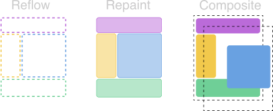

## 🤔 Animation Loop는 언제 실행되나요?



<p class="img-caption" style="margin: -20px 10px 0 10px;">
브라우저의 렌더링 과정의 일부분
</p>
<br />

Animation Loop는 브라우저 렌더링 과정에서 `repaint` 이전 단계에서 진행됩니다.

> **Reflow** <br /> 모든 요소의 크기와 위치를 다시 계산하는 과정 <br /> **Repaint** <br /> reflow 다음 단계, 레이아웃을 제외한 요소가 그려지는 과정<br /> **Composite** <br />다양한 요소를 레이어로 그룹화하고 이러한 레이어를 래스터화는 과정

---

## 🔮 SetInterval

### ⚡️ setInterval이란 무엇일까?

requestAnimationFrame의 등장 이전의 자바스크립트 애니메이션 구현에 `setTimeout`과 주로 사용되는 함수라고 합니다.
setInterval의 두번째 인자에 `인터벌`을 기입해 애니메이션의 **반복 속도를 조절**할 수 있는 장점이 있습니다.
하지만 디스플레이 성능을 고려하지 않은 짧은 업데이트 주기 때문에 애니메이션의 **프레임 드랍**이 발생하는 단점이 있습니다.


<p class="img-caption" style="margin: -15px 10px 0 10px;">
Jank: 스크롤, 전환 또는 애니메이션과 같이 화면의 움직임이 있을 때 사용자가 경험하는 버벅거림
</p>
<br />

### ⚡️ setInterval로 작성한 애니메이션

시간의 흐름에 따라 에몽가가 왼쪽으로 이동하는 애니메이션을 작성했습니다.
fps값도 계산했으니 하단에서 requestAnimationFrame과 결과를 비교해봅시다.

<div class="codebox-title">index.html - setInterval</div>

```javascript
const ele = document.querySelector('#emolga');
const pVal = document.querySelector('#p_value');
const cVal = document.querySelector('#c_value');

let xPos = 0;
let start = performance.now();
let timer;

const render = () => {
  if (xPos >= 500) clearInterval(timer);
  // 에몽가 x축 이동
  pVal.innerHTML = xPos;
  xPos += 1;
  ele.style.transform = `translateX(-${xPos}px)`;
  // 콜백 호출 주기 계산
  let action = performance.now();
  let diff = Math.trunc(action - start);
  start = action;
  cVal.innerHTML = `${diff}ms (${Math.trunc(1000 / diff)}fps)`;
};
timer = setInterval(render);
```

<br />

## 🔮 requestAnimationFrame

### ⚡️ requestAnimationFrame이란 무엇일까?

브라우저에게 수행하기를 원하는 애니메이션을 알리고 다음 `repaint`가 진행되기 전에 해당 애니메이션을 업데이트하는 함수를 디스플레이의 `화면 주사율`에 따른 주기로 호출하게 합니다.
**60프레임**을 목표로 동작하기 때문에 사용자에게 보다 나은 경험을 선사할 수 있습니다.👍


### ⚡️ requestAnimationFrame로 작성한 애니메이션

상단의 setInterval과 동일한 동작을 수행하는 애니메이션을 작성했습니다.
아래에서 둘의 결과를 비교해봅시다.

<div class="codebox-title">index.html - requestAnimationFrame</div>

```javascript
const ele = document.querySelector('#emolga');
const pVal = document.querySelector('#p_value');
const cVal = document.querySelector('#c_value');

let xPos = 0;
let start = performance.now();
let animationId;

const requestRender = () => {
  // 에몽가 x축 이동
  pVal.innerHTML = xPos;
  xPos += 1;
  ele.style.transform = `translateX(-${xPos}px)`;
  // 콜백 호출 주기 계산
  let action = performance.now();
  let diff = Math.trunc(action - start);
  start = action;
  cVal.innerHTML = `${diff}ms (${Math.trunc(1000 / diff)}fps)`;

  animationId = requestAnimationFrame(requestRender);
  if (xPos > 500) cancelAnimationFrame(animationId);
};
requestAnimationFrame(requestRender);
```

<br />

## 👩‍💻 이제 결과를 비교해 봅시다

<video src="javascript-animation-loop-04.mov" loop muted Autoplay=autoplay style="width: 100%; height: 100%; object-fit: cover;"></video>

<p class="img-caption" style="margin: -25px 10px 0 10px;">
setInterval과 requestAnimationFrame을 실행한 화면, 해당 영상은 120Hz의 디스플레이에서 녹화했습니다.
</p>
<br />

두 함수 동일하게 500번 반복될 동안 각각 **250fps** 와 **120fps**의 속도로 애니메이션이 구동했음을 확인할 수 있습니다. setInterval과 다르게 `requestAnimationFrame`은 디스플레이의 화면 주사율에 맞춰 애니메이션을 업데이트했음을 확인할 수 있습니다.
<br />
여기서는 언급이 없었지만, 다른 탭으로 이동하면 setInterval은 계속해서 동작하지만 requestAnimationFrame는 **동작을 일시중지**합니다. **복잡하고 큰 애니메이션**의 작업을 할 경우에는 `requestAnimationFrame`의 효과는 더 두드러질 것입니다.

---

## 👍 그래서 어떤 함수가 애니메이션에 더 적합한가요?

**requestAnimationFrame**을 다음과 같은 이유로 추천합니다!👍 👍

1. 브라우저가 **`repaint`를 실행하려 할 때 동기화**합니다.
2. **애니메이션에 최적화**된 함수이며, **`60fps`를 목표로 동작**하며 디스플레이에 따라 더 높은 프레임률을 보입니다.
3. 브라우저가 하는 일에 따라 **함수의 속도를 조절하고 일시중지** 합니다.
4. 브라우저 상태에 따라 함수가 일시중지되기에, **`CPU 리소스`와 `배터리 수명`을 낭비하지 않습니다.**
5. **모든 `최신 데스크톱` 및 `모바일 브라우저`에서 지원됩니다.**

**🤖 최근들어 애니메이션을 구현하기 위해서 setInterval과 setTimeout을 사용하지 않는 추세입니다.🤖**

<br />

## 😎 브라우저 벤더를 고려한다면!

<div class="codebox-title">script.js</div>

```javascript
const requestAnimationFrame =
  window.requestAnimationFrame ||
  window.mozRequestAnimationFrame ||
  window.webkitRequestAnimationFrame ||
  window.msRequestAnimationFrame;
```

**requesetAnimationFrame을 지원하지 않는 환경까지 고려한다면**

<div class="codebox-title">script.js</div>

```javascript
const requestAnimationFrame = (() => {
  return (
    window.requestAnimationFrame ||
    window.webkitRequestAnimationFrame ||
    window.mozRequestAnimationFrame ||
    window.oRequestAnimationFrame ||
    window.msRequestAnimationFrame ||
    ((callback) => {
      window.setTimeout(callback, 1000 / 60);
    })
  );
})();
```

---

틀린 설명 혹은 보충이 필요한 설명은 코멘트 달아주시면 감사하겠습니다! 🙏

```toc

```
