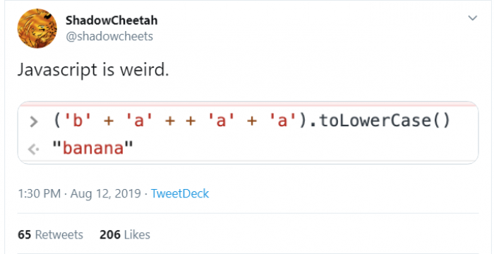

내 예상대로 결과를 보여주지 않는 **JavaScript**  
동작을 이해하기보다는 결과를 외우는 식으로 사용해왔지만

나의 주요 밥벌이 수단이 된 이상  
동작 원리와 개념을 제대로 알아보자!!

JavaScript banana meme

---

목차

1. [변수](https://jieunhanme.github.io/modern-javascript-deep-dive/01.변수/)

---

참고도서  
모던 자바스크립트 Deep Dive : 자바스크립트의 기본 개념과 동작 원리

 
 
