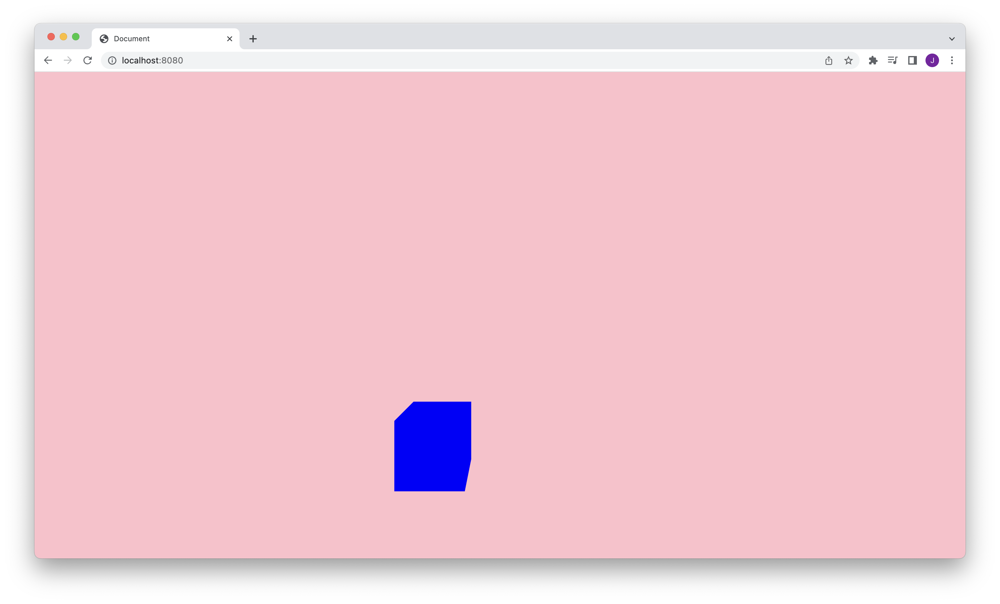

## 🐝 계단 현상제거

<div class="codebox-title">main.js</div>

```javascript
const renderer = new THREE.WebGLRenderer({
  canvas,
  antialias: true, // 계단현상 제거 >> (미미한) 성능 저하 가능성 있음
});
```

<br />

## 🐝 픽셀 밀도에 따른 그래픽 최적화

> **window.devicePixelRatio** <br /> 해당 기기의 픽셀 밀도를 수치화해 반환합니다. 수치가 높을수록 고해상도 화면이 제공되어야 합니다.

고해상도로 표현한다는 것은 canvas의 크기를 화면의 2배로 늘리고 해당 장면을 화면 크기로 압축해서 body에 표현하는 것을 의미합니다.
<br />

<div class="codebox-title">index.html - 최적화가 진행된 canvas 태그</div>

```html
<canvas
  id="three-canvas"
  data-engine="three.js r138"
  width="3024"
  height="934"
  style="width: 1512px; height: 467px;"
></canvas>
```

window.devicePixelRatio의 값이 소수이거나 과하게 클경우 성능 저하가 발생할 수 있습니다.
실제로는 1:1 혹은 2:1대응만 해준다면 화질에 문제가 없기때문에 1혹은 2의 비율로 그래픽 최적화를 진행합니다.

<div class="codebox-title">main.js</div>

```javascript
renderer.setPixelRatio(window.devicePixelRatio > 1 ? 2 : 1);
```

<br />

## 🐝 화면 사이즈 자동 조절

<div class="codebox-title">main.js</div>

```javascript
function setSize() {
  // 1. 카메라 조정(화면 사이즈 변경 === 카메라 종횡비 변경)
  camera.aspect = window.innerWidth / window.innerHeight;
  camera.updateProjectionMatrix();

  // 2. renderer로 다시 그려주기
  renderer.setSize(window.innerWidth, window.innerHeight);
  renderer.render(scene, camera);
}

// 리사이즈 이벤트 추가
window.addEventListener('resize', setSize);
```

<br />

## 🐝 배경색 색상 설정 및 투명도 조절

배경의 투명도는 `renderer`와 `scene`에서 조절해 줄 수 있습니다. **두객체를 통해 같이 조절해줄 경우 배경색은 scene에서 설정한 값**으로 덮어집니다.
아래와 같이 진행 할 경우, 분홍색 배경으로 설정됩니다.

<div class="codebox-title">main.js</div>

```javascript
const renderer = new THREE.WebGLRenderer({
  canvas,
  antialias: true,
  alpha: true, // renderer.setClearAlpha(0)와 같은 결과
});
renderer.setClearColor(0x00ff00, 0.1);

scene.background = new THREE.Color('pink');
```



```toc

```
